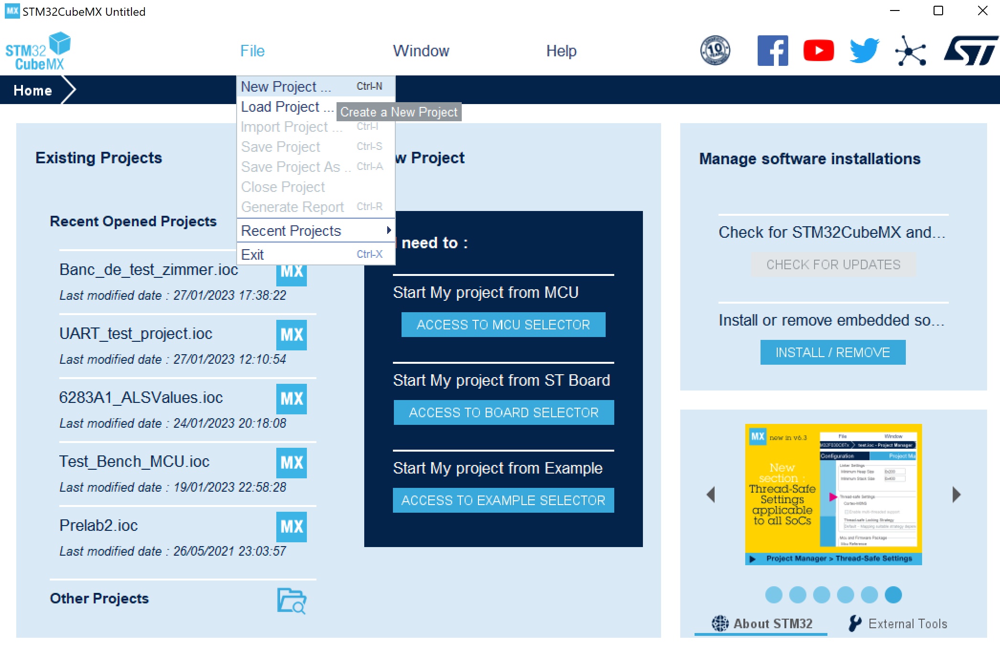
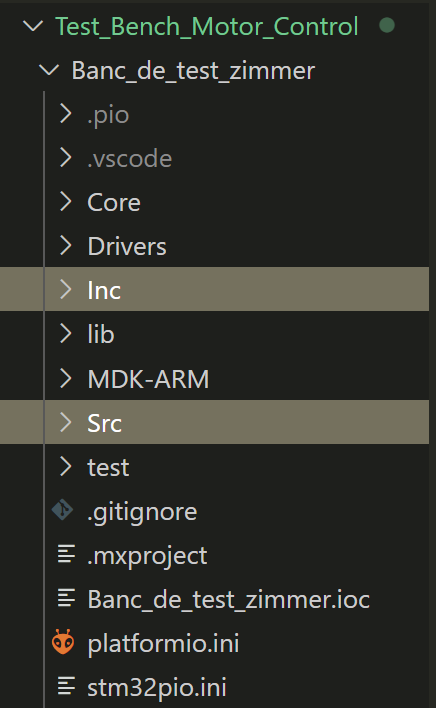
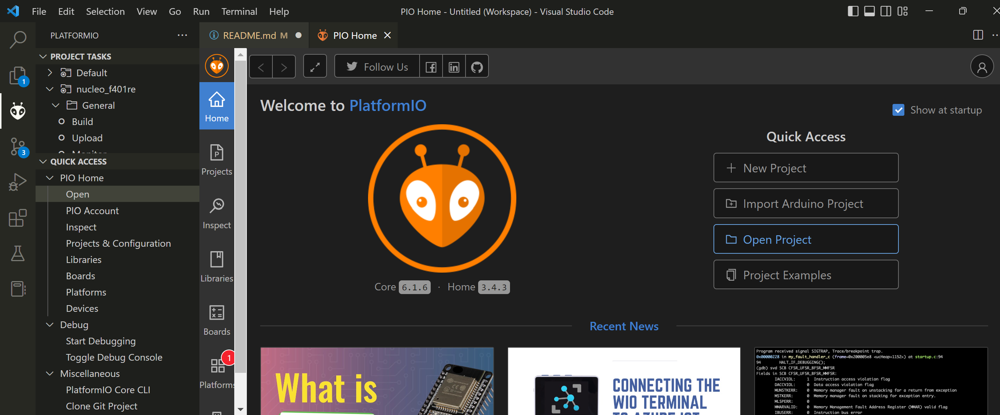
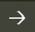

# Zimmer Test Bench - Motor Control Repo

## What is this all about?
Welcome to the repository for the MCU programming of the Zimmer Test Bench being developed by a group of students from Polytechnique Montréal.

The board used for this project is the NUCLEO-F401RE. The following instructions will guide you through the setup process to be able to setup the same type of CubeMX and PlatformIO projects.

The repo includes one main folder containing the CubeMX project configuration file and the PlatformIO setup file.

**You will find the source and header files in the **Core** folder**. Please be careful when writing new code as STM specifies certain blocks to write in.

## CubeMX project
This section will present you the required steps to program the NUCLEO-F401RE board and integrate the CubeMX folder in VSCode.

- Open CubeMX and select **New Project** in the **File** tab.

- Select the appropriate board in the list (in our case, it is the NUCLEO-F401RE).

- Configure the CubeMX project as desired. Under the **Project Manager** tab, in the **Project Location** section, select your Git repo folder.

- Under the same tab as before, in the **Toolchain / IDE** section, select *STM32CUBEIDE*.

- Under the **Code Generation** tab, select *Only copy the necessary library files*.

- You can then generate the code and confirm it has appeared in the right folder.

## PlatformIO project
This section will present the setup for integrating a PlatformIO project in a CubeMX project folder.
We will use the [stm32pio cross-platform app](https://github.com/ussserrr/stm32pio) as it is an easy-to-use tool.

- To be able to use the stm32pio tool, you must first download the PlatformIO extension on Visual Studio Code as shown in [the following](https://platformio.org/install/ide?install=vscode) page.

- After reading the stm32pio introductory page, refer to the [example page](https://github.com/ussserrr/stm32pio/tree/master/examples/cli). 
Following the instructions will generate a *.ini* file to your CubeMX project and add **Src** and **Inc** folders on the top level of your CubeMX project folder as shown below.

- If you ever want to modify the pin configurations or make any other hardware changes in the CubeMX project, use the **Generate Code** button from the CubeMX app (and not the **generate** command from stm32pio).

## Building and programming
This section presents how to build and program on the board the modified code in the **Src** and **Inc** folders generated by the stm32pio addon.

- Open the CubeMX project from the PlatformIO extension as shown below.

- To build your code, click on the  on the bottom of the VSCode window. To program your board, click on the  on the bottom of the VSCode window.
**If these options do not appear, simply reload the VSCode app.**

